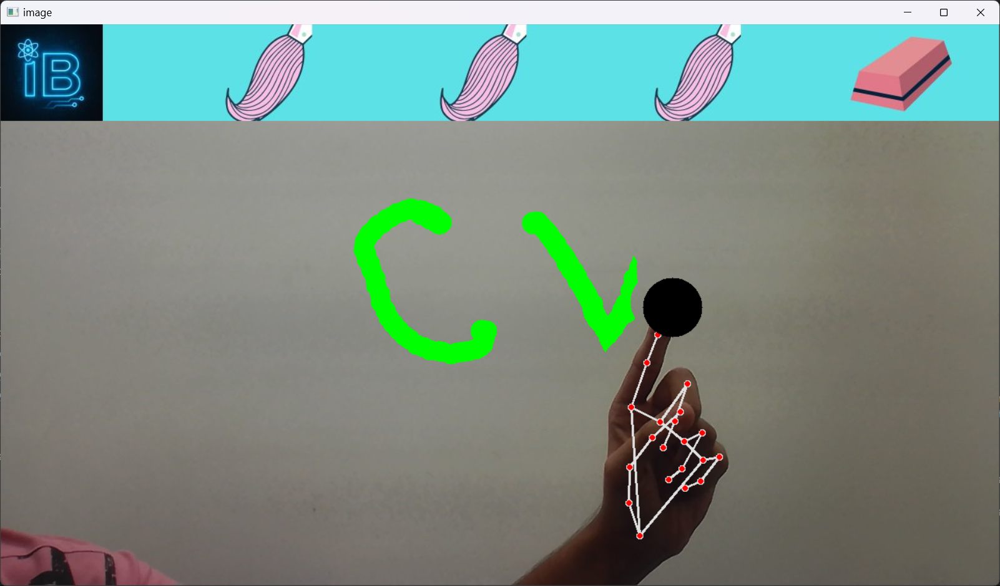

# Hand Tracking Virtual Painter 🎨✋


A real-time **AI-powered virtual painting** app that lets you draw on your screen using just your hand and a webcam—no mouse or stylus required! Built with OpenCV and MediaPipe for fast, accurate hand tracking and gesture recognition.

---

## 🖼️ Screenshots

  


  


  


---

## 🚀 Features

- **Real-time Hand Tracking**  
  MediaPipe’s hand landmark model enables precise fingertip detection and tracking.
- **Gesture-Based Controls**  
  - **Index Finger Up:** Draw on the canvas.
  - **Index + Middle Fingers Up:** Open color selection panel; hover to pick a color.
  - **Thumb + Pinky:** Switch to eraser mode.
- **Customizable Tools**  
  Adjust brush thickness and eraser size for detailed work.
- **Multi-Color Palette**  
  Instantly switch colors by hovering over the palette region.
- **Cross-Platform**  
  Works with any standard webcam on Windows, macOS, or Linux.

---

## 🧰 Tech Stack

- **Python 3.7+**
- **OpenCV** – Video capture, image processing, UI overlays
- **MediaPipe** – Hand landmark detection, gesture recognition
- **NumPy** – Efficient image matrix operations

---

## 📦 Installation

1. **Clone the repository**
   ```bash
   git clone https://github.com/IbrahimBagwan1/hand-tracking-virtual-painter.git
   cd hand-tracking-virtual-painter
   ```

2. **(Optional) Create & activate a virtual environment**
   ```bash
   python -m venv venv
   # Windows
   venv\Scripts\activate
   # macOS / Linux
   source venv/bin/activate
   ```

3. **Install dependencies**
   ```bash
   pip install -r requirements.txt
   ```

---

## ▶️ Usage

1. Connect your webcam.
2. Run the painter script:
   ```bash
   python app_virtual_painter.py
   ```
3. Start drawing!

**Controls:**
- **Drawing Mode:** Raise index finger
- **Color Selection:** Raise index + middle fingers, hover over a color in the top bar
- **Eraser Mode:** Make thumb + pinky gesture
- **Quit:** Press `x` at any time

---

## 🎯 How It Works

- **Hand Landmark Detection:**  
  MediaPipe locates 21 hand landmarks in each video frame.
- **Gesture Recognition:**  
  - Drawing: Only index fingertip above its PIP joint
  - Selection: Both index and middle fingertips up
  - Eraser: Thumb and pinky fingertips up together
- **Canvas Overlay:**  
  Drawing strokes are accumulated on a transparent canvas and overlaid on the live video feed using OpenCV.

---

## 🔍 SEO & Discoverability

**Keywords:** Hand Tracking, Virtual Painter, Gesture Recognition, OpenCV, MediaPipe, Python Drawing App, Real-time AI Drawing  
**Description:** Create stunning drawings with just your hand—no stylus or tablet needed. Leverage AI-driven hand tracking for an intuitive, marker-free digital painting experience.

---

## 🛡️ License

Distributed under the MIT License. See [LICENSE](LICENSE) for details.

---

## 🙌 Contributing

Contributions are welcome! To report bugs or propose enhancements:

1. Fork this repository
2. Create a new branch (`git checkout -b feature/my-feature`)
3. Commit your changes (`git commit -m "Add my feature"`)
4. Push to the branch (`git push origin feature/my-feature`)
5. Open a Pull Request

Please ensure all new code is well-documented and tested.

---

## 📬 Contact

Created by **Ibrahim Bagwan**  
Questions or feedback? Reach out via [GitHub Issues](https://github.com/IbrahimBagwan1/hand-tracking-virtual-painter/issues) 

---

Enjoy painting with your hands! 🎨✋